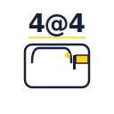
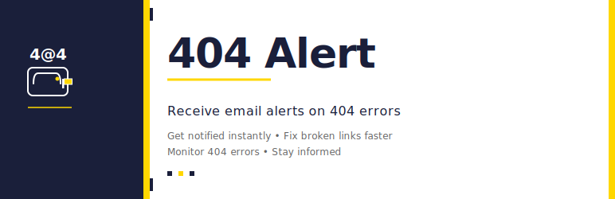

# Design Assets - 404 Alert

**Version:** 1.1.0  
**Created:** April 9, 2026  
**Format:** SVG (Scalable Vector Graphics)

---

## Overview

Five distinct design styles for the 404 Alert plugin, each with a corresponding icon (128×128px) and banner (1544×500px).

All assets are created in SVG format for maximum scalability and flexibility.

---

## Style 1: Modern Minimalist

**Color Scheme:** Blue/Cyan (`#0066CC`, `#00D9FF`)  
**Best For:** Tech-savvy users, WordPress developers, modern sites  
**Vibe:** Clean, professional, contemporary

### Files
- `icon-style-1-modern.svg` (128×128px)
- `banner-style-1-modern.svg` (1544×500px)

### Characteristics
- Geometric, minimalist shapes
- Cyan accent circles
- Email/notification indicator
- Light blue background
- Modern sans-serif typography

### Use Case
- WordPress.org plugin directory
- Developer-focused marketing
- Tech blogs and documentation

---

## Style 2: Bold & Vibrant

**Color Scheme:** Red/Orange (`#FF6B35`, `#FF4500`)  
**Best For:** High-impact visibility, call-to-action marketing  
**Vibe:** Energetic, attention-grabbing, urgent

### Files
- `icon-style-2-bold.svg` (128×128px)
- `banner-style-2-bold.svg` (1544×500px)

### Characteristics
- Exclamation mark alert symbol
- Bright yellow notification badge
- Gradient orange background
- Bold, high-contrast design
- Pulses effect on banner

### Use Case
- Marketing campaigns
- Alert and warning contexts
- High-visibility banners
- Email marketing

---

## Style 3: Professional & Classic

**Color Scheme:** Black/Gray (`#333333`, `#999999`, `#CCCCCC`)  
**Best For:** Enterprise, B2B, formal contexts  
**Vibe:** Sophisticated, trustworthy, timeless

### Files
- `icon-style-3-professional.svg` (128×128px)
- `banner-style-3-professional.svg` (1544×500px)

### Characteristics
- Elegant serif typography (Georgia)
- Minimalist borders and frames
- Corner detail marks
- Subtle alert indicator
- Clean, organized layout

### Use Case
- Enterprise WordPress sites
- Corporate documentation
- Professional directory listings
- Print media

---

## Style 4: Illustrated & Friendly

**Color Scheme:** Green/Teal (`#1AB394`, `#16A085`)  
**Best For:** Community-focused, approachable design  
**Vibe:** Friendly, helpful, solution-oriented

### Files
- `icon-style-4-illustrated.svg` (128×128px)
- `banner-style-4-illustrated.svg` (1544×500px)

### Characteristics
- Cartoon robot/computer character
- Smile and concerned expression
- Alert message bubble
- Yellow notification badge
- Warm, inviting colors

### Use Case
- Community sites
- User-friendly documentation
- SaaS platforms
- Educational content

---

## Style 5: Hybrid Modern

**Color Scheme:** Deep Blue + Orange (`#1e3a8a`, `#0c4a6e`, `#FF6B35`)  
**Best For:** Enterprise + modern, balanced approach  
**Vibe:** Professional yet contemporary, trustworthy innovation

### Files
- `icon-style-5-hybrid.svg` (128×128px)
- `banner-style-5-hybrid.svg` (1544×500px)

### Characteristics
- Shield shape (security/solution)
- Check mark inside shield
- Deep blue gradient with orange accent
- Stats highlighting
- Modern geometric elements
- Feature highlights

### Use Case
- WordPress.org official directory
- Premium plugin packages
- Enterprise deployments
- Balanced marketing appeal

---

## Usage Guidelines

### Icon (128×128px)

**WordPress.org Requirements:**
- Square format: 128×128px
- Transparent background (PNG)
- Should be visible at all sizes
- No text inside the icon (optional)
- Professional and recognizable

### Banner (1544×500px)

**WordPress.org Requirements:**
- Recommended size: 1544×500px
- Wide rectangular format
- Include plugin name
- Brief tagline (optional)
- Visual elements for recognition

### Conversion to PNG

To convert SVG to PNG for WordPress.org:

**Using ImageMagick (command line):**
```bash
# Icon
convert -background none -size 128x128 icon-style-X-*.svg icon-style-X-128.png

# Banner
convert -background white -size 1544x500 banner-style-X-*.svg banner-style-X-1544x500.png
```

**Using Online Tools:**
- https://cloudconvert.com/ (SVG → PNG)
- https://picsvg.com/ (Online SVG to PNG)
- https://onlineconverter.com/ (Free conversion)

### Scalability

SVG files can be scaled to any size without quality loss:

```html
<!-- Icon at different sizes -->



<!-- Banner at different sizes -->


```

---

## Recommended Selection

### For WordPress.org Directory
**→ Style 5: Hybrid Modern**
- Best professional appearance
- Balanced modern + trustworthy
- Appeals to both users and developers
- Strong visual hierarchy
- Differentiates from competitors

### For Marketing Website
**→ Style 2: Bold & Vibrant**
- High impact and visibility
- Clearly communicates "alert" aspect
- Memorable and distinctive
- Great for CTAs and social media
- Energetic brand personality

### For Technical Documentation
**→ Style 1: Modern Minimalist**
- Clean, professional appearance
- Resonates with developers
- Easy to integrate with code
- Modern aesthetic
- Excellent readability

### For Community Sites
**→ Style 4: Illustrated & Friendly**
- Approachable and welcoming
- Explains concept visually
- Encourages user engagement
- Fun without being childish
- Great for onboarding

### For Enterprise Deployments
**→ Style 3: Professional & Classic**
- Formal, trustworthy appearance
- Timeless design
- Print-ready quality
- Professional typography
- Corporate-appropriate

---

## Customization

All SVG files can be customized:

### Changing Colors
```xml
<!-- Change fill color -->
<circle fill="#0066CC" /> → <circle fill="#YOUR_COLOR" />

<!-- Change stroke color -->
<path stroke="#FF6B35" /> → <path stroke="#YOUR_COLOR" />
```

### Changing Text
```xml
<!-- Modify plugin name or tagline -->
<text>404 Alert</text> → <text>Your Plugin Name</text>
```

### Adjusting Size
```xml
<!-- Modify viewBox for scaling -->
<svg viewBox="0 0 128 128" /> → <svg viewBox="0 0 256 256" />
```

---

## Technical Details

### SVG Specifications
- **Format:** Scalable Vector Graphics (XML)
- **Icon Size:** 128×128px (viewBox)
- **Banner Size:** 1544×500px (viewBox)
- **Color Mode:** sRGB
- **Text Encoding:** UTF-8
- **Compression:** None (human-readable)

### Browser Compatibility
- ✅ All modern browsers (Chrome, Firefox, Safari, Edge)
- ✅ WordPress admin panel
- ✅ WordPress.org directory
- ✅ Mobile browsers

### Performance
- Small file sizes (5-15KB each)
- No external dependencies
- Instant rendering
- Responsive scaling
- Print-friendly

---

## File List

### Icons
```
icon-style-1-modern.svg
icon-style-2-bold.svg
icon-style-3-professional.svg
icon-style-4-illustrated.svg
icon-style-5-hybrid.svg
```

### Banners
```
banner-style-1-modern.svg
banner-style-2-bold.svg
banner-style-3-professional.svg
banner-style-4-illustrated.svg
banner-style-5-hybrid.svg
```

**Total:** 10 files (5 icons + 5 banners)

---

## Next Steps

1. **Choose Your Style**
   - Review all 5 options
   - Consider your target audience
   - Match your brand personality

2. **Convert to PNG** (if needed for WordPress.org)
   - Use ImageMagick or online converter
   - Ensure transparency for icons
   - Test at different sizes

3. **Upload to WordPress.org**
   - Icon: Goes in plugin directory
   - Banner: Displayed above plugin details

4. **Optional: Further Customization**
   - Adjust colors to match your brand
   - Modify text or messaging
   - Add your own features or badges

---

## Questions & Support

For SVG editing, use:
- **Inkscape** (free, open-source)
- **Adobe Illustrator** (professional)
- **Figma** (online, collaborative)
- **Online SVG editors** (quick edits)

All files are provided in human-readable SVG format for maximum flexibility.

---

**Status:** ✅ Ready for Production

Choose your style and use confidently in your WordPress.org submission!
